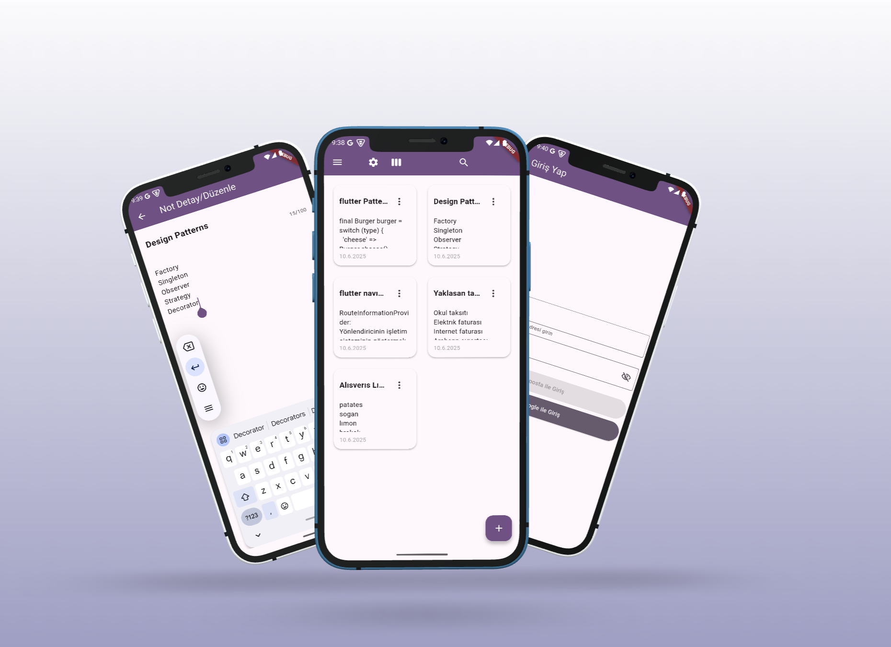

# one_note

OneNote benzeri, Flutter ile geliştirilmiş bir not alma uygulaması.

## Genel Bakış

Bu proje, modern Flutter uygulama mimarisiyle, not alma ve kullanıcı kimlik doğrulama işlevlerini bir araya getirir. Uygulama, **Riverpod** ile durum yönetimi, **Firebase** ile kimlik doğrulama ve veri saklama, katmanlı mimari ve temiz kod prensipleriyle geliştirilmiştir.

Ayrıca, uygulama **responsive** (duyarlı) tasarım prensiplerine uygun olarak geliştirilmiştir. Farklı ekran boyutlarına ve cihazlara (telefon, tablet, masaüstü) uyum sağlayacak şekilde arayüz dinamik olarak ölçeklenir ve düzenlenir. Böylece kullanıcı deneyimi tüm platformlarda tutarlı ve erişilebilir olacak şekilde optimize edilmiştir.

## Mimarinin Temel Bileşenleri

### Katmanlar

- **core/**: Uygulamanın genel altyapı ve yardımcı bileşenleri (navigasyon, widget'lar, sabitler, uzantılar, başlangıç sağlayıcıları).
- **features/**: Her bir işlevsel özelliğin (authentication, notes) kendi içinde ayrılmış katmanları:
  - **domain/**: Temel modeller ve soyutlamalar (ör. `Note`, `AppUser`).
  - **data/**: Veri kaynakları ve repository implementasyonları (ör. Firestore, FirebaseAuth).
  - **application/**: İş mantığı ve servisler (ör. not ekleme/güncelleme servisleri).
  - **presentation/**: Kullanıcı arayüzü ve controller'lar (ör. ekranlar, state yönetimi).

### Durum Yönetimi

- **Riverpod** kullanılır. Tüm sağlayıcılar (provider) `ProviderScope` ile yönetilir.
- Özellik bazlı controller ve servisler ile iş mantığı ayrıştırılır.
- Asenkron işlemler için `AsyncNotifier`, `FutureProvider`, `StreamProvider` gibi Riverpod tipleri kullanılır.

### Navigasyon

- **RouterDelegate** ve **RouteInformationParser** ile Flutter'ın modern router API'si kullanılır.
- Sayfa yönetimi ve yönlendirme, Riverpod ile entegre şekilde merkezi olarak yönetilir.

### Kimlik Doğrulama

- **FirebaseAuth** ve **Google Sign-In** ile kullanıcı girişi ve oturum yönetimi.
- Kullanıcı modeli (`AppUser`) domain katmanında tanımlanır.
- Kimlik doğrulama işlemleri soyut repository üzerinden yönetilir.

### Not Yönetimi

- Notlar, Firestore üzerinde kullanıcıya özel olarak saklanır.
- Not ekleme, güncelleme, silme ve listeleme işlemleri repository ve servis katmanlarında ayrıştırılmıştır.
- Not modeli (`Note`) domain katmanında tanımlanır.

## Klasör Yapısı

Bu projede, modern yazılım geliştirme prensiplerine uygun olarak **feature-based** (özellik tabanlı) klasörleme yaklaşımı benimsenmiştir. Her bir ana özellik (örneğin authentication, notes) kendi içinde domain, data, application ve presentation katmanlarına ayrılarak, kodun okunabilirliği, sürdürülebilirliği ve yeniden kullanılabilirliği artırılmıştır. Bu yapı sayesinde, yeni bir özellik eklemek veya mevcut bir özelliği geliştirmek çok daha kolay ve izole bir şekilde gerçekleştirilebilir.

```
lib/
  core/
    app_startup_provider/
    constants/
    extensions/
    navigation/
    utils/
    widgets/
  features/
    authentication/
      application/
      data/
      domain/
      presentation/
    notes/
      application/
      data/
      domain/
      presentation/
  main.dart
  firebase_options.dart
```

## Kullanılan Teknolojiler

- **Flutter** (Material 3)
- **Riverpod** (State ve DI çözümü olarak **v3.0**)
- **Firebase** (Auth, Firestore)
- **Google Sign-In**

## Katmanlı Mimari Prensipleri

- **Temiz Kod**: Her dosya tek bir sorumluluğa odaklanır.
- **Bağımlılıkların Ayrılması**: Veri, iş mantığı ve sunum katmanları ayrıdır.
- **Test Edilebilirlik**: Servisler ve repository'ler kolayca test edilebilir.
- **Yeniden Kullanılabilirlik**: Widget'lar ve yardımcı fonksiyonlar core altında toplanır.

## Geliştirme ve Katkı


Firebase yapılandırması için `firebase_options.dart` dosyasını güncelleyin.

## Offline (Çevrimdışı) Özellikler

Uygulama, Firestore'un yerleşik offline (çevrimdışı) desteğinden yararlanır. Yani:

- **Veri Önbellekleme:** Son okunan notlar cihazda önbelleğe alınır ve internet bağlantısı olmasa bile görüntülenebilir.
- **Çevrimdışı Değişiklikler:** Kullanıcı çevrimdışıyken not ekleyebilir, güncelleyebilir veya silebilir. Bu değişiklikler, cihaz tekrar internete bağlandığında otomatik olarak Firestore ile senkronize edilir.
- **Ekstra Kurulum Gerektirmez:** Android ve iOS için ekstra bir ayar yapmaya gerek yoktur; Firestore paketi bu özelliği varsayılan olarak sunar.

## Uygulama Ekran Görüntüleri



---

## Flutter Mimarisi

Bu projede uygulama mimarisi ve kod organizasyonu için [Flutter resmi mimari rehberi](https://docs.flutter.dev/app-architecture) referans alınmıştır.

> **Kaynak:**  
> [Flutter App Architecture - Official Docs](https://docs.flutter.dev/app-architecture)

---

